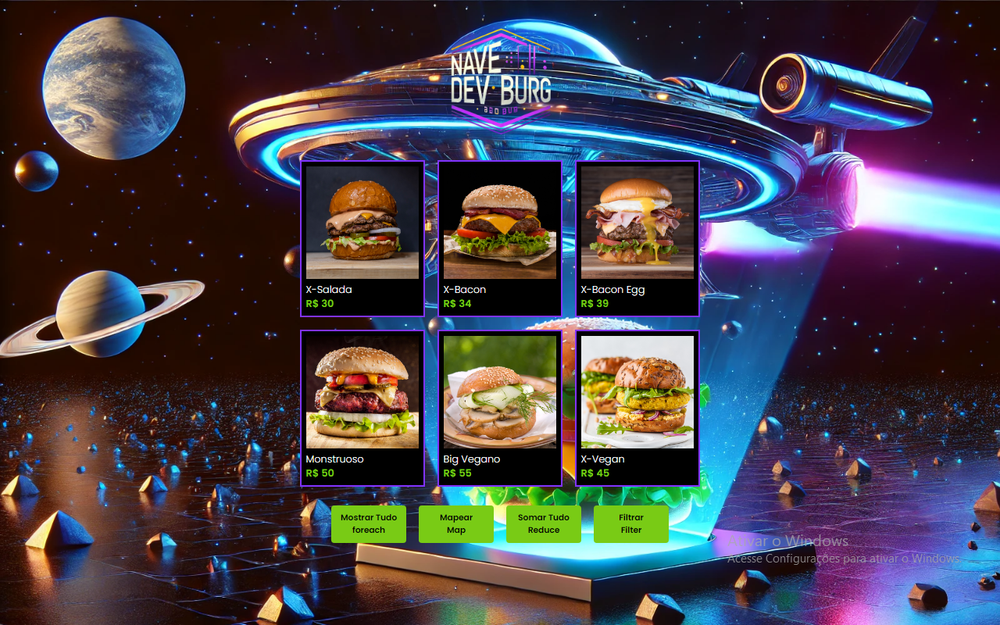

 

##F uncionalidades da Aplicação

A aplicação demonstra o uso de métodos funcionais do JavaScript para manipulação de dados, exibindo produtos (hambúrgueres) de forma dinâmica na interface. Os principais recursos implementados são:

Mostrar Tudo (forEach):
Exibe todos os produtos disponíveis na lista, percorrendo cada item do array e renderizando-os na tela.

Mapear (map):
Cria uma nova lista de produtos com base na original, permitindo transformar ou extrair informações específicas de cada item.

Somar Tudo (reduce):
Calcula valores agregados a partir da lista de produtos, como somatório de preços ou quantidades, retornando um único valor resultante.

Filtrar (filter):
Permite selecionar apenas os produtos que atendem a critérios específicos, como tipo de hambúrguer ou faixa de preço, gerando uma lista filtrada.

Tecnologias Relacionadas

JavaScript: Utilizado para manipulação de arrays e integração dinâmica com a interface.

HTML/CSS: Estrutura e estilo da interface, exibindo os produtos e botões de interação.

DOM Manipulation: Atualização da página em tempo real com base nas ações do usuário (ex.: clicar em “Mostrar Tudo” ou “Filtrar”).
